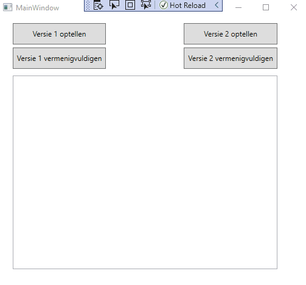

# Oefening arrays vullen met random getallen

In deze oefening ga je random getallen laten generen en deze bewaren in verschillende arrays.  
Bij het klikken op de knoppen zullen bewerkingen dienen uitgevoerd te worden op deze getallen en het resultaat zal moeten afgebeeld worden in de listbox.  
Er is reeds een random generator aanwezig met de naam rnd.  

Je start met 2 keer 5 willekeurige getallen te laten genereren van 1 tot 500.  
De eerste 5 getallen ga je toevoegen aan een ééndimensionele int array met 5 elementen met de naam **version1Numbers1**, de volgende 5 getallen voeg je toe aan een andere ééndimensionele int array met 5 elementen met de naam **version1Numbers2**.
Vervolgens voorzie je nog een één dimensionele int array met de naam **version1Results** met 5 elementen.  
Deze 3 arrays declareer je globaal.
Het vullen van de eerste 2 arrays doe je tijdens het laden van je programma.

Vervolgens ga je nog eens 2 keer 5 willikeurige getallen genereren van 1 tot 500.  
De eerste van deze nieuwe 5 getallen bewaar je in de eerste kolom van een tweedimensionle int array met 5 rijen en 3 kolommen met de naam **version2**.  
De volgende 5 van deze nieuwe getallen bewaar je in de tweede kolom van deze tweedimensionele int array.  
Ook deze (tweedimensionele) array declareer je globaal.
En ook deze array vul je zoals hierboven beschreven tijdens het laden van je programma.

Wanneer je op btnVersion1Add klikt dien je de array **version1Results** te vullen met de som van de getallen die in **version1Numbers1** en **version1Numbers2** zitten op het zelfde indeksnummer.  
Is dit gebeurd (dus nadat je de 5 berekeningen hebt gedaan), dan toon je het resultaat in de listbox (zie afbeelding onderaan voor de juiste weergave).
Hetzelfde gebeurt ongeveer wanneer je op btnVersion1Multiply klikt, maar nu dien je de 2 corresponderende getallen te vermenigvuldigen (het resultaat blijft in **version1Results** terecht komen).  
Opnieuw toon je het resultaat in de listbox.

Wanneer je op btnVersion2Add klikt dienen de getallen uit de eerste 2 kolommen van de array **version2** bij elkaar opgeteld te worden, en het resultaat dient in de derde kolom van dezelfde rij bewaard te worden.  
Hetzelfde gebeurt wanneer je op btnVersion2Multiply klikt, maar nu worden de getallen uit de eerste 2 kolommen met elkaar vermenigvuldigd.
Uiteraard toon je nu ook telkens de resultaten in de listbox.

  

Ter info : van zodra we lussen hebben behandeld hernemen we deze oefening en zal je merken dat dit allemaal veel korter kan!

